# PME Online System Design

## A. Use Case
Bab ini menspesifikasi interaksi berbagai aktor dan host terhadap sistem PME Online.

### A.1. SysAdmin
System administrator melakukan operasi dasar system.
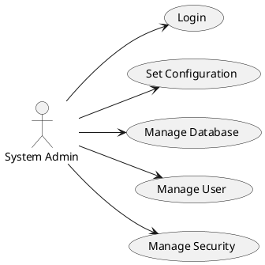

### A.2. eClear
Use-case eClear terhadap PME Online. Interaksi melalui API.
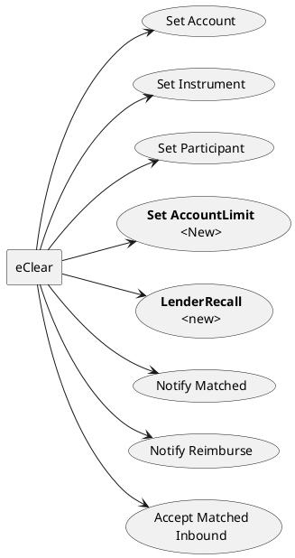

> Lend Change/Swap Correction dipending dahulu.
> Lending Recall out of scope.

---
- [x] Ada usecase apa lagi ?
> Order tidak perlu dikirim ke eClears
> Entry Order dari eClears
> Tdk ada portfolio tapi AccountLimit
> Ada mekanisme LenderChange dan LenderSwap

- [x] Selain Entry Order apakah ada juga Withdraw dan Amend ?
> Bukan entry order, tapi recall

> Remove usecase SetParameter
---
### A.3. KPEI Admin
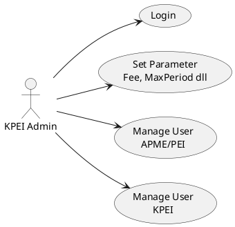
---
- [x] Ada usecase apa lagi ?
> Set parameter

- [x] Prefer ada relasi antara KPEI Admin dengan APME
> Ada mekanisme bridging

> Static data tdk bisa dirubah

---
### KPEI User
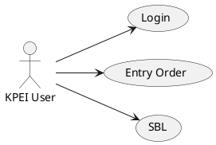

Ada bridging User ke AK (APME/PEI)

---
### User PEI
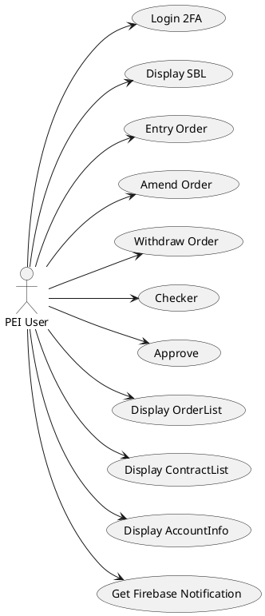

Ada bridging User ke AK (APME/PEI)

---
### A.4. User APME
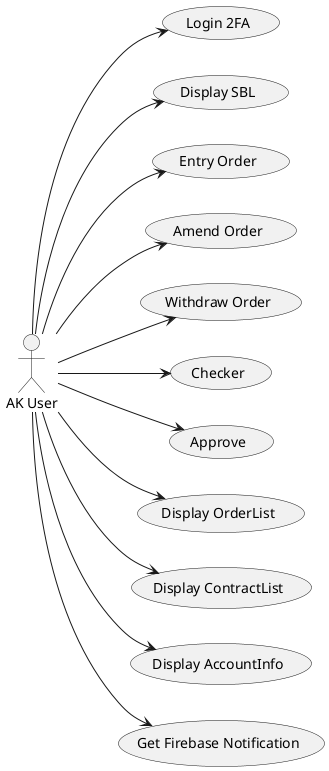

Ada bridging User ke AK (APME/PEI)

---
- [x] Ada usecase apa lagi ?
> Notifikasi firebase style untuk mobile

> Authentication 2FA -> Email
---

### A.5. OLT APME
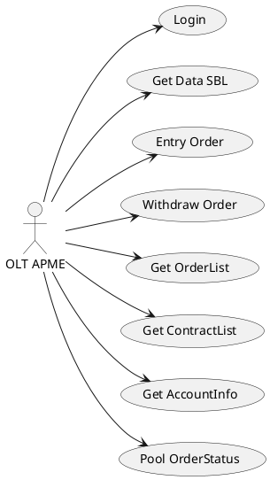
---
- [ ] Ada usecase apa lagi ?
> Answer
---
## B. Architecture
### B.1. Technology Stack
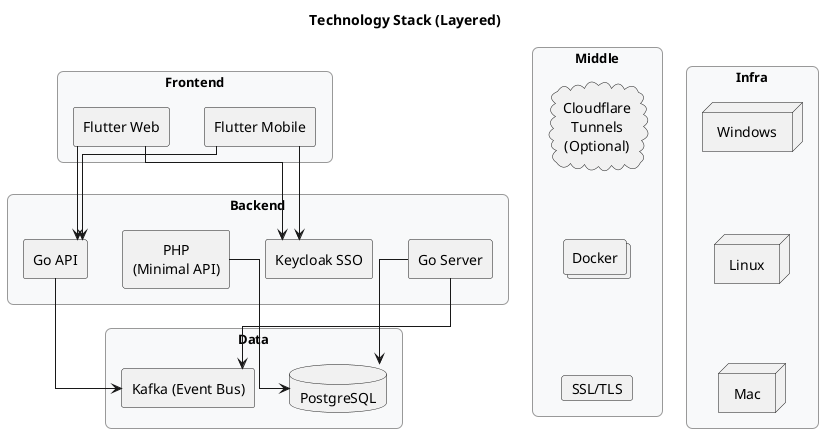

<b>Software Version Planned</b>
No | Software   | Version |
---|------------|---------|
1  | Kafka      | 4.1
2  | Golang     | 1.25
3  | Flutter    | 3.35
4  | PostgreSql | 18
5  | SSL/TLS    | 1.3
6  | Docker     | 28.5
7  | Keycloak   | 26.4

<b>Recomended OS</b>
Redhat Linux 9

---
- [ ] Apakah ada preferensi khusus ?
> Answer
---

### B.2. System Connectivity
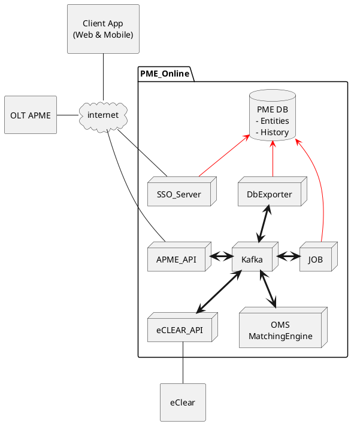
<b>Estimated Resource for Day-1</b>
No|Server|Core | RAM | DMZ
|--|------|-----|-----|----|
1|Kaftka    |2 | 4GB | No 
2|PostgreSql|2 | 8GB | No
3|SSO       |2 | 4GB | Yes
4|DbExport  |2 | 4GB | No
5|eCLEAR API|2 | 4GB | Yes
6|APME API  |4 | 8GB | Yes
7|OMS       |2 | 8GB | No
8|Job Scheduller |1 | 4GB | No

### B.3. Security

Authentikasi dan authorisasi menggunakan model SSO dengan memanfaatkan fungsi JWT token (Access token & refresh token). Alternatif yang diusulkan menggunakan system Keycloak dari Apache (OpenID Connect, OAuth 2.0).

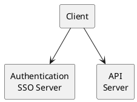

Flow security pada komunikasi data.

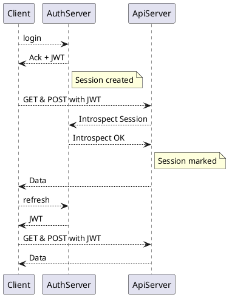
---
- [x] Berapa lama durasi validity Access token ?
> Akan dibuat parameterize
- [x] Apakah perlu penerapan token rotation ?
> Tentatif akan di implementasikan.
- [x] Akses mana saja yg perlu 2FA ?
> Answer
> Usul untuk OLT API dan Web / Mobile PME saat login
> Alternatif OLT API menggunakan whitelist

---
## C. Dataflow
Mekanisme komunikasi menggunakan pola arsitektur microservice, yaitu API dan Publish-Subscribe. Pertukaran data utama adalah menggunakan model Publish-Subscribe dengan menggunakan Kafka.

Prinsip dasarnya:
- Aktivitas yang mengubah state harus melalui Kafka
- Aktivitas yang tidak merubah data menggunakan data lokal atau melalui API internal.

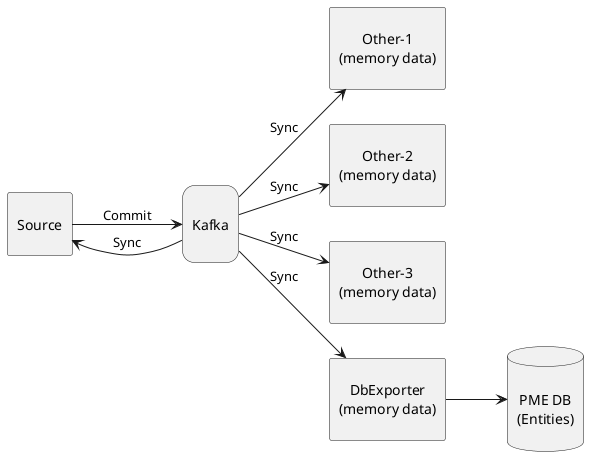
### C.1. Data Inisialization
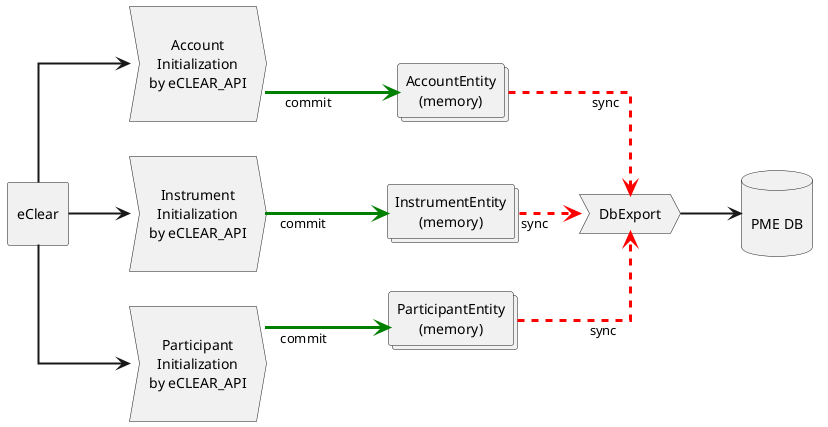
---
- [x] Data master apa lagi yang diperoleh dari eClear?
> Portfolio tidak ada, adanya Account Limit
---
### C.2. Entry Order

#### C.2.1 Order New
Penerimaan Order melakukan pengechekan validitas data.

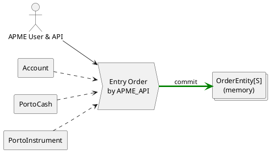
MatchingEngine bertindak sebagai OMS, mengecheck risk management dan memutuskan bahwa Order diterima atau ditolak.

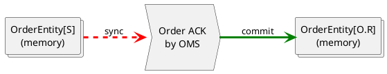
Status Order dilaporkan balik ke APME.

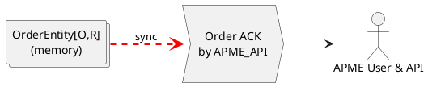

Subsequently data Order committed to database. 
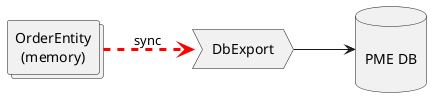
---
- [x] Apakah data Order harus dikirim ke eClear ?
> Tidak, **Lendable Pool & Borrowing Needs** adanya di sistem PME saja.
---

#### C.2.2 Amend Order
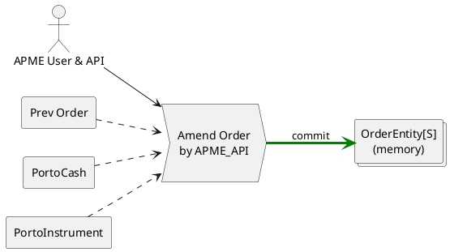

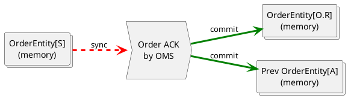
Status Order dilaporkan balik ke APME.

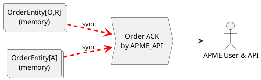

#### C.2.3 Withdraw Order
```plantuml
@startuml
left to right direction
skinparam defaultTextAlignment center

collections "OrderWithdraw\nCommand" as O
process "\nOrder Withdraw ACK\nby OMS\n" as P0
collections "OrderEntity[W]\n(memory)" as O1

O .[#red;thickness=3].> P0 : sync
P0 -[#green;thickness=3]-> O1 : commit
@enduml
```
Status Order dilaporkan balik ke APME.

```plantuml
@startuml
left to right direction
skinparam defaultTextAlignment center

collections "OrderEntity[W]\n(memory)" as O
process "\nOrder Withdraw ACK\nby APME_API\n" as P0
actor "APME User & API" as U

O .[#red;thickness=3].> P0 : sync
P0 --> U
@enduml
```
### C.3. Matching & PME Contract
Mathcing engine melakukan process matching dan menghasilkan entity Contract.

```plantuml
@startuml
skinparam defaultTextAlignment center

collections "OrderEntity BOR\n(memory)" as OB
collections "OrderEntity LEN\n(memory)" as OL
collections "Account" as A
collections "PortoCash" as C
collections "PortoInstrument" as S
collections "ContractEntity[S]\n(memory)" as Trx

process "\nMatching\nby OMS\n" as P0

OB .[#red;thickness=3].> P0 : sync
OL .[#red;thickness=3].> P0 : sync
A .right.> P0
C .right.> P0
S .right.> P0
P0 -[#green;thickness=3]right--> Trx : commit
@enduml
```
Matching approval adalah pengiriman Contract ke eClear.

```plantuml
@startuml
left to right direction
skinparam defaultTextAlignment center
collections "ContractEntity[S]\n(memory)" as Trx
collections "ContractEntity[B]\n(memory)" as Trx1
process "\nContractApproval\nby eCLEAR_API\n" as P0
rectangle "eClear API" as ecl

Trx .[#red;thickness=3].> P0 : Sync
P0 --> ecl
P0 -[#green;thickness=3]-> Trx1 : commit

@enduml
```

Contract approved from eClear.

```plantuml
@startuml
left to right direction
skinparam defaultTextAlignment center
collections "ContractEntity[B]\n(memory)" as Trx1
collections "ContractEntity[O]\n(memory)" as Trx
process "\nContractApproved\nby eCLEAR_API\n" as P0
rectangle "eClear API" as ecl

ecl --> P0
Trx1 ..> P0
P0 -[#green;thickness=3]-> Trx : commit
@enduml
```
Status Order dan Contract dilaporkan ke APME.
```plantuml
@startuml
left to right direction
collections "ContractEntity[O]\n(memory)" as Trx
process "\nMatch Info\nby APME_API\n" as P0
actor "APME User & API" as U

Trx .[#red;thickness=3].> P0 : sync
P0 --> U
@enduml
```

Subsequently semua data Contract committed to database. 
```plantuml
@startuml
left to right direction
skinparam defaultTextAlignment center

collections "ContractEntity\n(memory)" as O

process "DbExport" as dbexport
database "\nPME DB\n" as db

O .[#red;thickness=3].> dbexport : sync
dbexport --> db
@enduml
```
---
- [x] Pembentukan contract apakah ada approval dari eClear ? Terkait pool.
> Ya, akan ada ACK dari eClear.
> Jika sampai EOD belum ada ACK maka Order di definisikan status Gagal.

- [x] Kalau NAK apakah Order harus di drop ?
> Tidak ada konsep NAK

---
### C.4. Reimbursement
Perintah reimbursement didapat dari eClear.
```plantuml
@startuml
left to right direction
skinparam defaultTextAlignment center

rectangle "eClear" as ecl
process "\nReimbursement\nby eCLEAR_API\n" as reim
collections "ReimburseEntity\n(memory)" as r
collections "ContractEntity[C]\n(memory)" as Trx

ecl --> reim
reim -[#green;thickness=3]-> r : commit
r -- Trx : =
@enduml
```

Process Reimbursement dilaporkan ke APME. 
```plantuml
@startuml
left to right direction
skinparam defaultTextAlignment center

collections "ContractEntity[C]\n(memory)" as O

process "\nClosing Info\nby APME_API\n" as dbexport
Actor "APME User & API" as U

O .[#red;thickness=3].> dbexport : sync
dbexport --> U
@enduml
```

Subsequently semua data Contract committed to database. 
```plantuml
@startuml
left to right direction
skinparam defaultTextAlignment center

collections "ContractEntity[C]\n(memory)" as O

process "DbExport" as dbexport
database "\nPME DB\n" as db

O .[#red;thickness=3].> dbexport : sync
dbexport --> db
@enduml
```

### C.5 Pergantian Kode Lender

> **Fitur ini di drop**

```plantuml
@startuml
left to right direction
skinparam defaultTextAlignment center

actor "APME User & API" as U
rectangle "Prev Order" as A
rectangle "PortoCash" as C
rectangle "PortoInstrument" as S
process "\nLenderSwap Order\nby APME_API\n" as P0
collections "OrderEntity[S]\n(memory)" as O

U --> P0
P0 -[#green;thickness=3]-> O : commit
A .down.> P0
C .down.> P0
S .down.> P0
@enduml
```

```plantuml
@startuml
left to right direction
skinparam defaultTextAlignment center

collections "OrderEntity[S]\n(memory)" as O
rectangle "Prev Order" as A
process "\nLenderSwap Order\nby OMS\n" as P0

O .[#red;thickness=3].> P0 : sync
A ..> P0
P0 --> (?)
@enduml
```

---
- [x] Operasi ini apakah menciptakan Order baru ?
> Fitur ini di drop
- [x] Operasi ini apakah menciptakan Contract baru ?
> Fitur ini di drop
---

## D. Data Model
Dokumen ini menspesifikasi model data yang digunakan dalam sistem PME Online, dalam implementasinya dimungkinkan untuk ditambahkan data-data pendukung operasi selama masa development.

### D.1. Master Data
Berikut adalah data-data master pada sistem PME Online.

---
- [x] Data apa saja yg diterima dari eClear ?
> Instrument (with eligibility status).
> Account.
> Participant (with eligibility status).

- [x] Kapan saat nya setiap masing2 data tersedia atau dikirimkan ?
> Data nya sebenarnya di Get anytime

Jangan lupa saat ada yg menjadi ineligible, maka Matching engine freeze proses, akan ada state Order baru.
Order baru di reject.

---

#### D.1.1. Instrument
Instrument adalah semua symbol surat berharga yang dapat dipinjamkan.
```plantuml
@startuml
class Instrument {
    int NID
    str Code    // Kode stok
    str Name    // stok Name
    str Type
    bool Status // Eligible
}
@enduml
```
---
- [x] Apakah field yang lain ?
> Status eligibility -> Untuk block matching. Reject order baru.

> Instrument yg Ineligible tidak boleh masuk SBL.
---

#### D.1.2. Holiday
Hari-hari libur (kecuali Sabtu dan Minggu) dalam tahun kalender berjalan.

```plantuml
@startuml
class Holiday {
    int NID
    int Tahun
    date Date
    str Description
}
@enduml
```
---
- [x] Apakah field yang lain ?
> Standard
---

#### D.1.3. Parameter
Parameter setting yang digunakan dalam perhitungan.

```plantuml
@startuml
class Parameter {
    int NID
    datetime Update
    str Description
    double FlatFee
    double LendingFee
    double BorrowingFee
    double MaxQuantity.   // Max
    int BorrowMaxOpenDay    
    int DenominationLimit // Min 100
}
@enduml
```

```plantuml
@startuml
class SessionTime {
    int NID
    str Description
    datetime Update
    time Session1Start
    time Session1End
    time Session2Start
    time Session2End
}
@enduml
```
---
- [x] Apakah field yang lain ?
> Ok
- [x] Parameter Dashboard SBL apakah berupa daftar field ?
> Yes akan ada setting field apa saja yg ditampilkan. Untuk Type user yg berbeda preffer bisa berbeda field set nya.
---

### D.2. Account
Akun Nasabah yang dapat melakukan pinjam-meminjam efek.

```plantuml
@startuml
interface Participant {
    int NID
    ...
}

class Account {
    int NID
    str Code    // "YU-012345"-01/02/04/05
    str SID
    str Name
    str Address
    int ParticipantNID
    str ParticipantCode
}

Account::BrokerNID -right-> Participant::NID
@enduml
```
---
- [x] Apakah sebuah SID terikat pada satu Participant ?
> No, tapi setiap Akun pada broker memiliki code yang unik. Susunannya : 2 karakter kode participant + 6 karakter kode unit.
- [x] Dari mana didapat data mapping Account <-> Participant
> dari eClears
- [x] Apakah field yang lain ?
> Tidak

- [x] Apakah ada kemungkinkan sebuah akun tidak berada dalam sebuah participant ?
> Answer

---

### D.3. Participant
Participant adalah anggota kliring AK.

```plantuml
@startuml
class Participant {
    int NID
    str Code  // YU
    str Name
    bool BorrEligibility
    bool LendEligibility
}
@enduml
```
---
- [x] Apakah field yang lain ?
> Eligibility
---

### D.4. Portfolio Data
> Note : Tidak ada data portfolio. Hanya TradeLimit dan PoolLimit

```plantuml
@startuml
class AccountLimit {
    int NID
    int AccountNID
    double TradeLimit
    double PoolLimit
}

interface Account {
    int NID
    ...
}

AccountLimit::AccountNID -right-> Account::NID
@enduml
```

#### D.4.1. Portfolio Cash Data

---
- [x] Apakah ada AR AP ?
> Tidak ada data portfolio
---

#### D.4.2. Portfolio Instrument Data
---
- [x] Apakah ada data Blocked, AR, AP ?
> Tidak ada data portfolio
---

### D.5. Order Data
Order data adalah perintah Borrow atau Lending yang dientry via API OLT-APME atau PME-Online apps.

```plantuml
@startuml
class Order {
    int NID
    int PrevNID -> Amendment
    str ReffRequestID
    int AccountNID
    str AccountCode
    int ParticipantNID
    str ParticipantCode
    int InstrumentNID
    str InstrumentCode
    str Side
    double Quantity
    datetime settlementDate
    datetime reimbursementDate
    int Periode
    str State
    double MarketPrice
    double Rate
    str Instruction
    bool ARO
    datetime EntryAt
    datetime AmmendAt
    datetime WithdrawAt
}

interface Account {
    int NID
    ...
}
interface Participant {
    int NID
    ...
}
interface Instrument {
    int NID
    ...
}

Order::AccountNID -left-> Account::NID
Order::ParticipantNID -up-> Participant::NID
Order::InstrumentNID -right-> Instrument::NID

@enduml
```
<b>State of Order</b>

```plantuml
@startuml
skinparam defaultTextAlignment center

state S : Saved
state O : Open
state P : Partial
state M : Matched
state A : Amended
state W : Withdrawn
state R : Rejected
state B : BlockProcess

[*] --> S
S --> O
S --> R
O --> P
O --> M
O --> A
P --> A
S --> W
O --> W
P --> W
P --> M
O --> B
B --> O
P --> B
B --> P
B --> M
M --> O : Reim\nARO
@enduml
```

---
- [x] User menentukan tanggal settlement apakah ini berarti bisa tidak langsung settle saat trade di kirim ke eClear ?
> **Penting** Settlement data menentukan saat Order menjadi status Open, di set Pending-New.

- [x] Bagaimana jika Contract diterminasi di tengah jalan ?
> Sisi Lender saat hendak melakukan terminasi di tengah jalan harus diganti dengan Account lain (Recall).
- [x] Apakah Borrower dapat melakukan terminasi di tengah jalan ? Tidak ?
> Jika PME akan Reimbursement. 

- [x] Satuan transaksi shares atau lot ?
> Shares
- [x] Pembentukan contract apakah ada approval dari eClear ?
> Yes, kasus fail akan di infokan, tapi akhir hari didrop.
- [x] Data instruction gunanya untuk apa ?
> Free text

- [x] <b>Jika Order ARO tapi sisi Lender kosong (atau utk open-rate tidak ada matching lawan), apa yg terjadi ? ARO mengasumsikan Borrower belum menyerahkan kembali barangnya.</b>
> Aro selalu melibatkan pihak sebelumnya.

<b>Perlu didiskusikan internal KPEI Usulan</b>
Ada jenis respons saat kirim match ke eClear:
- Success : Normal langsung Trade O
- Overdue/Cancel : Barang atau Uang blm ada

---

### D.6. Trade & Contract Data
Trade data adalah hasil dari matching dan sudah diverifikasi oleh eClears.
Contract adalah status PME masing-masing sisi.
Sebuah Trade akan memiliki sepasang Contract untuk sisi Borrowing dan sisi Lending.

> Jika di tengah jalan ada perubahan Lender maka akan digenerate Contract baru sisi Lender. Contract lama akan Closed. Trade akan memiliki 2 Contract Lender dengan salah satunya berstatus Closed.

```plantuml
@startuml
class Trade {
    int NID
    str KpeiReff
    int InstrumentNID
    str InstrumentCode
    double Quantity
    int Periode
    str State
    double feeFlatRate
    double feeBorrRate
    double feeLendRate
    datetime MatchedAt
    datetime ReimburseAt
    Contract[] Lender
    Contract[] Borrower
}

class Contract {
    int NID
    int TradeNID
    str KpeiReff
    str Side
    int AccountNID
    str AccountCode
    str AccountSID
    int AccountParticipantNID
    str AccountParticipantCode
    int OrderNID
    int InstrumentNID
    str InstrumentCode
    double Quantity
    int Periode
    str State
    double feeFlatVal
    double feeValDaily
    double feeValAccumulated
    datetime MatchedAt
    datetime ReimburseAt
}

interface Instrument {
    int NID
    ...
}
interface Account {
    int NID
    ...
}
interface Order {
    int NID
    ...
}

Trade::InstrumentNID -right-> Instrument::NID
Trade::Borrower --> Contract::NID
Trade::Lender --> Contract::NID

Contract::AccountNID -left-> Account::NID
Contract::OrderNID -right-> Order::NID
@enduml
```
<b>State of Trade</b>
```plantuml
@startuml
left to right direction

state S : Submitted
state E : Approval
state O : Open
state R : Rejected
state C : Closed

[*] --> S
S --> E
S --> R
E --> O
O --> C : Reim
@enduml
```

<b>State of Contract</b>
```plantuml
@startuml
left to right direction

state S : Submitted
state E : Approval
state O : Open
state R : Rejected
state C : Closed
state T : Terminated

[*] --> S
S --> E
S --> R
E --> O
O --> C : Reim
O --> T : Swap/Change
@enduml
```

<b>Konsep penting !!!</b>
> Kontrak prinsipnya terjadi antara Borrower dengan KPEI atau Lender dengan KPEI. Sehingga tidak dibutuhkan pengetahuan informasi counterparty.

Masing2 sisi akan mendapatkan data Contract sesuai data masing2. Data Contract saat match field feeValue masih berisi 0.

> Setiap EOD masing2 sisi akan dikirim data Contract dengan perhitungan fee terakumulasi.

```plantuml
@startuml
class Contract {
    int NID
    str KpeiReff
    int InstrumentNID
    str InstrumentCode
    double Quantity
    int Periode
    int AccountNID
    str AccountCode
    str AccountSID
    int AccountParticipantNID
    str AccountParticipantCode
    int OrderNID
    str State
    double feeFlatRate <- <b>Hanya borrower</b>
    double feeBorrRate/feeLendRate <- <b>Fee masing2 sisi</b>
    double feeBorrVal/feeLendVal <- <b>Perhitungan daily</b>
    double feeBorrValAccum/feeLendValAccum <- <b>Perhitungan akumulated ?</b>
    datetime MatchedAt
    datetime ReimburseAt
}
@enduml
```

---
- [x] Bagaimana model data fee ? Daily atau akumulated ? Please confirm
> Perlu diinfokan keduanya (note MarketPx fluktuatif)
- [x] Bagaimana jika Contract diterminasi di tengah jalan ?
> Sisi Lender saat hendak melakukan terminasi di tengah jalan harus melakukan recall, dari eClear akan push perintah recall.
- [x] Apakah Borrower dapat melakukan terminasi di tengah jalan ? Tidak ?
> Borrower dapat melakukan early reimbursement, dari eClear akan push data reim ke PME.
---

### D.7. Reimburse Trade Data

Adalah perintah untuk melakukan reimburse atau terminasi sebuah <b>Trade</b> dan berikut <b>Contract</b> masing2 sisi.

```plantuml
@startuml
class ReimburseOrder {
    int NID
    int ContractNID
    str KpeiReff
    int InstrumentNID
    str InstrumentCode
    double Quantity
    int Periode
    int BorNID
    str BorCode
    str BorSID
    int BorParticipantNID
    str BorParticipantCode
    int BorOrderNID
    int LenNID
    str LenCode
    str LenSID
    int LenParticipantNID
    str LenParticipantCode
    int LenOrderNID
    double feeFlat
    double feeBorrRate
    double feeLendRate
    double feeBorrVal
    double feeLendVal
    datetime ReimburseAt
}
interface Contract {
    int NID
    ...
}

ReimburseOrder::ContractNID -right-> Contract::NID
@enduml
```

> Pada hari reimbursement akan dikirimkan ke masing2 APME data <b>Contract</b> dengan status <b>C (Closed)</b> dan nilai feeBorrVal atau feeLendVal berisi nilai total selama periode.

> Pengiriman saat EOD sama seperti setiap harinya.

---
- [x] Kapan saatnya ReimburseOrder dikirim oleh eClear ? EOD ?
> Saat EOD
> Kalau ARO akan ada reimb dengan penanda ARO

---
### D.8. SBL Data

Adalah antrian Order Borrowing dan Lending yang masih <b>Open</b> untuk sebuah security.

```plantuml
@startuml
class SBL {
    int InstrumentNID
    str InstrumentCode
    double MarketPrice
    Order[] Borrow
    Order[] Lend
}
class Order {
    int OrderNID
    int AccountNID
    str AccountCode
    str SID
    int ParticipantNID
    str ParticipantCode
    str Side
    double Quantity
    datetime settlementDate
    datetime reimbursementDate
    int Periode
    double Rate
    bool ARO
    datetime EntryAt
}

SBL::Borrow -right-> Order::OrderNID
SBL::Lend -right-> Order::OrderNID
@enduml
```
---
- [x] Data apa yang dibutuhkan ?
> **Tentatif** : semua data Order
- [x] Data apa saja yang ditampilkan ?
> **Tentatif** : bisa dikonfigurasi secara system.
---
### D.9. User Data
Adalah User login entity untuk mengakses sistem PME Online.
Setiap UserType memiliki sekumpulan Role.
Sebuah Role menspesifikasi sekumpulan fungsi yang dapat diakses.
Secara default sebuah User mengikuti Role UserType yang bersangkutan. Namun ada kondisi ada Role tambahan yang dapat diassign di luar yg ada pada UserType nya (Optional).

#### previous suggested

```plantuml
@startuml
class User {
    int NID
    str Code
    str Name
    int TypeNID
    int[] RoleNID
    int BrokerNID
    str BrokerCode
    str Email
    str Password
    str PIN
    datetime createdAt
    datetime lastLoginAt
    datetime lastChangePasswordAt
}
class UserType {
    int NID
    str Code
    str Description
    int[] RoleNID
}
class UserRole {
    int NID
    str Code
    str Description
}

User::TypeNID -left-> UserType::NID
UserType::RoleNID --> UserRole::NID
User::RoleNID -left-> UserRole::NID
@enduml
```
<b>Roles</b>
- SysAdmin
- Admin
- SBL View
- SBL Export
- Order List
- Order Entry
- Order Withdraw

<b>User Type</b>
- Admin System. Role: SysAdmin + Admin
- Admin KPEI. Role : Admin + SBL + Export + OrderList + Withdraw
- APME API. Role : SBL + OrderEntry + Withdraw + OrderList
- APME User. Role : SBL + OrderEntry + Withdraw + OrderList
- Other User. Role : SBL + Export

<b>Account Access Partition</b>
1. SysAdmin, Other : None
2. Admin : All
3. APME API, APME User : Related AK Only

#### New suggested

```plantuml
@startuml

entity User {
  int NID
  str Code
  str Name
  int TypeNID
  int[] RoleNID
  int BrokerNID
  str BrokerCode
  str Email
  str Password
  str PIN
  datetime createdAt
  datetime lastLoginAt
  datetime lastChangePasswordAt
}

record GroupUser {
  int NID
  int UserNID
  int GroupNID
}

class Group {
  int NID
  str Code
  str Description
}

GroupUser::UserNID -left-> User::NID
GroupUser::GroupNID -right-> Group::NID

class Role {
  int NID
  str Code
  str Description
}

record GroupRole {
  int NID
  int GroupNID
  int RoleNID
}

GroupRole::RoleNID -right-> Role::NID
GroupRole::GroupNID -left-> Group::NID

class Permission {
  int NID
  str Code
  str Description
}

record RolePermission {
  int NID
  int PermissionNID
  int RoleNID
}

RolePermission::PermissionNID -right-> Permission::NID
RolePermission::RoleNID -left-> Role::NID


@enduml
```

**Permission** : adalah satuan Usecase / Operation:
1. Config_View
2. Config_Edit
3. Param_View
4. Param_Edit
5. User_View
6. User_Create
7. User_Edit
8. SBL_View_Detail
9. SBL_View_Aggregate
10. XX_View_Orderlist
11. XX_View_Contractlist
12. XX_Order_Entry
13. XX_Order_Check
14. XX_Order_Approve

> XX adalah kode partisipan

**Role** : Peran dengan berbagai permission
1. SBL_View --> SBL_View_Detail, SBL_View_Aggregate
2. XX_View --> XX_View_Orderlist, XX_View_Contractlist
3. XX_Entry --> XX_View_Orderlist, XX_View_Contractlist, XX_Order_Entry
4. XX_Check --> XX_View_Orderlist, XX_View_Contractlist, XX_Order_Entry, XX_Order_Check
5. XX_Approve --> XX_View_Orderlist, XX_View_Contractlist, XX_Order_Entry, XX_Order_Check, XX_Order_Approve
6. Admin Param --> Param_View, Param_Edit
7. Admin User --> User_View, User_Create, User_Edit
8. System Admin --> Config_View, Config_Edit

**Group** :
1. Sys Admin 
2. KPEI Admin --> SBL_View, Admin Param, Admin User, XX_View (all XX)
3. KPEI User --> XX_View (all XX)
4. APME Entry --> XX_Entry
5. APME Check --> XX_Check
6. APME Approve --> XX_Approve
7. PEI Entry --> XX_Entry
8. PEI Check --> XX_Check
9. PEI Approve --> XX_Approve

---
- [x] Ada berapa jenis User ?
> Ada 9 Jenis User
- [x] Ada berapa jenis Role ?
> Ada 8 Jenis Role
---

### D.10. Perubahan Kode Lender Data

> **Fitur ini di pending !!!**

Adalah perintah untuk mengalihkan Account Lender pada masa Contract masih berjalan. Account baru harus berada pada partisipan yang sama.

> Tidak terjadi process matching baru sebab walau sisi Borrower tidak berubah namun sisi Lender telah ditentukan. OMS akan membuat <b>Contract baru</b> pada <b>Trade</b> yang sama.

```plantuml
@startuml
class ChangeLender {
    int NID
    str ReffRequestID
    int ContractNID
    str KpeiReff
    int AccountNID
    str AccountCode
    str SID
    int ParticipantNID
    str ParticipantCode
    int <b>NewAccountNID</b>
    str <b>NewAccountCode</b>
    str <b>NewSID</b>
}

interface Contract {
    int NID
    ...
}

ChangeLender::ContractNID -right-> Contract::NID
@enduml
```

### D.11. Lender Recall
Adalah perintah untuk mengalihkan sisi Lender melalui proses Matching.

> LenderSwap akan diantrikan pada proses matching seperti halnya Order Borrow biasa. Proses akan dianggap berhasil jika terdapat sisi Lend yang baru. Saat berhasil matched tidak akan dicreate <b>Trade</b> baru namun <b>Contract Lending</b> baru.

```plantuml
@startuml
class RecallLender {
    int NID
    str ReffRequestID
    int ContractNID
    str KpeiReff
    int AccountNID
    str AccountCode
    str SID
    int ParticipantNID
    str ParticipantCode
}

interface Contract {
    int NID
    ...
}

RecallLender::ContractNID -right-> Contract::NID
@enduml
```

---
- [x] Jika New Lender berbeda APME siapa yg akan entry Order SwapLender ?
> Konsep Lender Recall adalah melakukan matching ulang Borrower ke Lender baru yg ada di Lendable Pool
---

## E. Sequence Kinematics
### E.1. Order Entry

Sekuen entry Order dari APME.

```plantuml
@startuml
actor "APME" as APME
boundary "APME_API" as APME_API
participant "OMS" as OMS
APME -> APME_API : http: POST Order
APME_API -> OMS : New Order
Note right of OMS: Risk Evaluate
APME_API <- OMS : Order ACK/NAK
APME <- APME_API : 200 OK\n422 UNPROCESSED
Note right of OMS: if ACK\nMatchingEngine Evaluate
@enduml
```

### E.2. Order Matching & Trade

```plantuml
@startuml
actor "APME_LEN" as APME2
actor "APME_BOR" as APME1
boundary "APME_API" as APME_API
participant "OMS" as OMS
boundary "eCLEAR_API" as eCLEAR_API
actor "eClear" as ecl
Note right of OMS: if ACK\nMatchingEngine Evaluate\nMATCHED
OMS -> eCLEAR_API : Trade Approval
eCLEAR_API -> ecl : Trade Approval
eCLEAR_API <- ecl : Trade Approved
OMS <- eCLEAR_API : Trade Approved
APME_API <- OMS : Trade Approved
APME1 <- APME_API : wss: Order Matched
APME2 <- APME_API : wss: Order Matched
APME1 <- APME_API : wss: New Trade
APME2 <- APME_API : wss: New Trade
@enduml
```

## F. Algoritma & Equation
Algoritma adalah seluruh aspek perhitungan yang terjadi di dalam sistem PME Online.

### F.1. Risk Management
#### F.1.1. Pre-Trade Borrowing
Perhitungan kecukupan dana nasabah dihitung dengan membandingkan <b>TradingLimit (eClears)</b> dengan nilai pinjaman ditambah total fee.

$$Borr_{Val}=MktPx*Quantity$$
$$TotalFee=Borr_{Val}*Fee_{Borr}*Period+Fee_{Flat}$$
> Pake hanya ini

$$TradingLimit_{eClear}>=TotalFee+Borr_{Val}$$
Apabila kondisi ini tidak terpenuhi maka Order Borrowing akan direject.

<b>Ada 2 angka</b>
- Trading Limit
- Pool Limit = NAV / Effective Collateral


#### F.1.1. Pre-Trade Lending
> Untuk Lending tidak ada perhitungan apa-apa

### F.2. Matching Engine
Required Rule for Matching process.
1. Instrumen lender/borrower sama.
2. APME yang sama (diutamakan lender-borrower inhouse, jika tidak ada yang inhouse, baru matching dengan APME yang berbeda).
3. Untuk lending, diutamakan volume lender lebih besar dari borrower, maka time priority dulu agar lebih efisien sisi lender (memitigasi
lender lebih banyak dalam 1 borr request).
4. Untuk borrowing, diutamakan time priority input dengan prinsip first in first out (FIFO).

```plantuml
@startuml
scale 1.5
start
if (Order Side?) then (Borrow)
  :Get All Lend Orders\n(Same Participant);
  :Sort by Qty Desc;
  :Matching;
  if (Full ?) then (No)
    :Get All Lend Orders;
    :Sort by Qty Desc;
    :Matching;
    if (Full ?) then (No)
      :Queue;
    endif
  endif
else (Lend)
  :Get All Borrow Orders\n(Same Participant);
  :Sort by Qty Time Asc;
  :Matching;
  if (Full ?) then (No)
    :Get All Borrow Orders;
    :Sort by Qty Time Asc;
    :Matching;
    if (Full ?) then (No)
      :Queue;
    endif
  endif
endif

stop
@enduml
```
### F.3. Fee
#### F.3.1 Borrowing Fee
Static 18%

#### F.3.2 Lending Revenue
Static 15%

---

## G. GUI 
Berikut adalah wireframe GUI Application.
### G.1. Order

> Rate Static atau Open ?

#### G.1.1. Borrowing Form
```plantuml
@startsalt
scale 1.5
{+
    <b>Borrowing Order</b>
{+
{
  Participant   |.| AA
  SID           |.| ^123456789ABCDEF^
  Instrument    |.| ^AALI           ^
  Volume        |.| {"1.000     " | (shares)}
  SettlementDate |.| {"2025-12-01"  | <size:18><&calendar> }
  ReimburseDate |.| {"2026-01-01"  | <size:18><&calendar> }
  Periode       |.| { "30 " | days }
  Rate          |.| 18%
  ARO           |.| ^ARO            ^
  Instruction   |.| "                "
}
{ [  Cancel  ]  | [Send Borrow] }
}
}
@endsalt
```

#### G.1.2. Lending Form

```plantuml
@startsalt
scale 1.5
{+
    <b>Lending Order</b>
{+
{
  Participant|.| AA
  SID        |.| ^123456789ABCDEF^
  Instrument |.| ^AALI           ^
  Volume     |.| {"1.000     " | (shares)}
  Rate       |.| 15%
}
{ [  Cancel  ]  | [Send Lend] }
}
}
@endsalt
```

#### G.1.3. Amend Form
```plantuml
@startsalt
scale 1.5
{+
    <b>Borrowing Amend Order</b>
{+
{
  Participant   |.| AA
  SID           |.| ^123456789ABCDEF^
  Instrument    |.| AALI
  Volume        |.| {"1.000     " | (shares)}
  SettlementDate |.| {"2025-12-01"  | <size:18><&calendar> }
  ReimburseDate |.| {"2025-12-01"  | <size:18><&calendar> }
  Periode       |.| {"30 " | days}
  Rate          |.| 18%
  ARO           |.| ^ARO            ^
  Instruction   |.| "                "
}
{ [  Cancel  ]  | [Send Borrow] }
}
}
@endsalt
```

> Reimbursement Date dan Periode saling otomatis di hitung.

```plantuml
@startsalt
scale 1.5
{+
    <b>Lending Amend Order</b>
{+
{
  Participant|.| AA
  SID        |.| ^123456789ABCDEF^
  Instrument |.| AALI
  Volume     |.| {"1.000     " | (shares)}
  Rate       |.| 15%
}
{ [  Cancel  ]  | [Send Lend] }
}
}
@endsalt
```
---
- [x] Field apa saja yang boleh di amend ?
> Borrow : Volume, Dates, ARO status
> Lend : Volume
---

#### G.1.4. Order List & Withdraw Form

```plantuml
@startsalt
scale 1.5
{+
<b>Order List</b>
{+
{#
No | OrderID | Instrument |B/L | Quantity | Periode | Rate | State | Date | .
1  | 24067   | AAAA       |BORR| 1.000    | 30      | 8% | O | 2025-10-10 | {[W]|[A]}
2  | 24073   | AAAA       |BORR| 7.000    | 30      | 8% | M | 2025-10-23 | .
3  | 24189   | AAAA       |BORR| 3.000    | 30      | 8% | O | 2025-11-02 | {[W]|[A]}
4  | 24189   | BBBB       |LEND| 2.000    | 60      | 5% | O | 2025-11-02 | {[W]|[A]}
}
}
}
@endsalt
```

#### G.1.5. Lending Recall
> Recall dianggap seperti order Borrow yang di rematch dengan Lender baru yang tersedia. Walau yang di rematch adalah sisi Borrow namun yang mentrigger adalah sisi Lender.

> Bisa bertemu dengan lain partisipant walau prioritas partisipan yg sama (untuk skema static Rate).

> Akan membentuk <b>Contract baru</b> Contract yg lama akan di Closed.

```plantuml
@startsalt
scale 1.5
{+
  <b>Lending Recall</b>
  {+
    Contract:       |.| 12345678
    OrderID:        |.| 1000012
    Instrument:     |.| AAAA
    Side:           |.| LEND
    Quantity:       |.| 3.000 (shares)
    SettleDate:     |.| 2025-10-20
    ReimburseDate:  |.| 2025-12-20
    Account SID:    |.| 123456789ABCDE
    Account Name:   |.| Kapten Marvel
    Participant:    |.| AA
  }
  {
    [Cancel] | [Send Recall]
  }
}
@endsalt
```

#### G.1.5. Lending Change Account / Correction
> 

```plantuml
@startsalt
scale 1.5
{+
  <b>Lending Change</b>
  {+
    Contract:       |.| 12345678
    OrderID:        |.| 1000012
    Instrument:     |.| AAAA
    Side:           |.| LEND
    Quantity:       |.| 3.000 (shares)
    SettleDate:     |.| 2025-10-20
    ReimburseDate:  |.| 2025-12-20
    Account SID:    |.| 123456789ABCDE
    Account Name:   |.| Kapten Marvel
    Participant:    |.| AA
    New SID         |.| "type new SID  "
  }
  {
    [Cancel] | [Send Change Lender]
  }
}
@endsalt
```

### G.2. SBL
#### G.2.1. SBL Detail
Menampilkan seluruh Order Lending / Borrowing.

```plantuml
@startsalt
scale 1.5
{+
<b>SBL Detail</b>
{+
{^"Filter"
{
{
. | Participant |.| "XX         " |.| Instrument |.| ^AALI    ^ | .
. | SID         |.| "123456789  " |.| Side       |.| ^Borrow  ^  | .
. | Status      |.| ^O         ^  |.| ARO        |.| ^ARO     ^ | .
}
}|
{.| [Reset]    |.
.| [Apply] }
}
{S
{#
"No" | "Participant" | "SID" | "Instrument" | "Side" | "Qty (Len)" | "Qty (Bor)" | "Rate" | "ARO" | "Fill"
1 | AA| 1234| AAAA| B| .| 1.000| 8%| . | 0
3 | CC| 2345| BBBB| L| 500| .| 5%| Yes | 0
4 | DD| .| .| .| .| .| .| .  | .
5 | EE| .| .| .| .| .| .| .  | .
}
}
}
{ [Export Borr] | [Export Lend] | [Export All] }
}
@endsalt
```

#### Model Orderbook
> Jika open rate maka akan muncul Order di kedua sisi.

```plantuml
@startsalt
scale 1.5
{+
    <b>Orderbook</b>
    {+
    {Instrument: |.| ^AAAA^ |.| KPEI: |.| 3%}
    {#
        "#" | "Lot"   | "BORR"  | "LEND" | "Lot"   | "#"
        3 | 1.000 | 7.20% | 7.21% | 500   | 1
       25 | 3.000 | 7.10% | 7.25% | 1.500 | 4
       10 | 7.000 | 6.85% | 7.40% | 8.500 | 7
        2 |   500 | 6.50% | 7.80% | 3.500 | 6
    }
    }
}
@endsalt
```

---
- [x] Bagaimana dengan Kpei Fee ? Karena akan menjadi Spread
> Model rate yang digunakan adalah fixed atau static.
---

#### G.2.2. SBL Aggregate
Menampilkan posisi net SBL apakah Borrow atau Lend untuk sebuah instrument. Dalam PME hanya salah satu side saja yang terisi (mengantri). Karena matching hanya berdasarkan availability lawan maka pasti salah satu side habis.

```plantuml
@startsalt
scale 1.5
{+
<b>SBL Aggregate</b>
{+
{^"Filter"
{
{
.| Instrument |.| ^AAAA    ^ | . 
.| Side       |.| ^Borrow  ^ | .
}
}|
{.| [Reset]    |.
.| [Apply] }
}
{S
{#
" No " | "Instrument " | "Quantity" | "Side"
1  | AAAA       |  123.100 | Lend
2  | BBBB       |   26.000 | Borr
3  | CCCC       |  123.100 | Borr
4  | DDDD       |  123.100 | Lend
}
}
}
 [Export]
}
@endsalt
```

### G.3. Logon
Login form to start authentication. Reset password mengirimkan link untuk reset password melalui email.

```plantuml
@startsalt
scale 1.5
{+
{
  <&person>User   |.| "username   "
  <&key> Password |.| "****       "
}
{
    [Login] | [Reset Password]
}
}
@endsalt
```

Jika user lupa username nya maka dapat melakukan reset password dengan memasukkan email address. 
```plantuml
@startsalt
scale 1.5
{+
{
  <&person>Email   |.| "name@domain   "
}
{
  [Forget Password]
}
}
@endsalt
```
---
- [x] Email address didapat dari static data investor ?
> Di entry saat admin manage
---

### G.4 History

#### G.4.1 Order History
```plantuml
@startsalt
scale 1.5
{+
<b>SBL Detail</b>
{+
{^"Filter"
{
{
. | Participant |.| ^XX        ^ |.| Instrument |.| ^AALI    ^ | .
. | SID         |.| "123456789  " |.| Side       |.| ^All     ^  | .
. | Status      |.| ^M         ^  |.| ARO        |.| ^All     ^ | .
}
}|
{.| [Reset]    |.
.| [Apply] }
}
{S
{#
"No" | "Date" | "Participant" | "SID" | "Instrument" | "Side" | "Qty" | "ARO" | "Status"
1 | yyyy-MM-dd | AA| 1234| .| .| .| .| .| .
3 | yyyy-MM-dd | CC| .| .| .| .| .| .| .
4 | yyyy-MM-dd | DD| .| .| .| .| .| .| . 
5 | yyyy-MM-dd | EE| .| .| .| .| .| .| . 
}
}
}
[Export]
}
@endsalt
```

---

## H. API Design
- Seluruh API dilakukan menggunakan HTTP dengan payload JSON data.
- Untuk data status yang bersifat push disediakan kanal WebSocket dengan data yang memiliki sequence-number.

### H.1. API eClear

#### eClears to PME

##### Set Account
**Url:** http://{domain}/account/insert

**Method:** POST

**Content:** JSON Array

**Member Fields:**
| Type   | Field    | Description     |
|--------|----------|-----------------|
| str    | Code     | Unique Account Code. Example: "YU-012345" | 
| str    | Name     | Account Name    |
| str    | SID      | Valid SID       |
| str    | Email    | Email Address   |
| str    | Address  | Postal Address  |
| str    | Participant | Valid Participant Code  |

##### Set Instrument
**Url:** http://{domain}/instrument/insert

**Method:** POST

**Content:** JSON Array

**Member Fields:**
| Type   | Field    | Description     |
|--------|----------|-----------------|
| str    | Code     | Unique Instrument Code | 
| str    | Name     | Instrument Name |
| bool   |Status    | Eligibility     |

##### Set Participant

**Url:** http://{domain}/participant/insert

**Method:** POST

**Content:** JSON Array

**Member Fields:**
| Type   | Field    | Description     |
|--------|----------|-----------------|
| str    | Code     | Unique Participant Code. Example: "YU" | 
| str    | Name     | Participant Name |
| bool   | BorrEligibility | Borrow Eligibility     |
| bool   | LendEligibility | Lending Eligibility     |

##### Set AccountLimit
**Url:** http://{domain}/account/limit

**Method:** POST

**Content:** JSON Array

**Member Fields:**
| Type   | Field    | Description     |
|--------|----------|-----------------|
| str    | Code     | Unique Account Code. Example: "YU-012345" | 
| double | BorrLimit| Borrow Limit    |
| double | PoolLimit| Pool Limit      |

##### Matched Confirm

**Url:** http://{domain}/contract/matched

**Method:** POST

**Content:** JSON Object

**Fields:**
| Type   | Field    | Description     |
|--------|----------|-----------------|
| str    | PmeTradeReff   | PME Unique trade ID  |
| str    | State     | "OK" |
| str    | BorrContractReff | Borrow PmeContractReff     |
| str    | LendcontractReff | Lender PmeContractReff     |
| datetime| OpenTime      | Settled date-time  |

##### Reimburse

**Url:** http://{domain}/contract/reimburse

**Method:** POST

**Content:** JSON Object

**Fields:**
| Type   | Field    | Description     |
|--------|----------|-----------------|
| str    | PmeTradeReff   | PME Unique trade ID  |
| str    | State     | "REIM" / "ARO" |
| str    | BorrContractReff | Borrow PmeContractReff     |
| str    | LendcontractReff | Lender PmeContractReff     |
| datetime| OpenTime      | Settled date-time  |

#### PME to eClears

##### Matched
**Url:** http://{eClears-domain}/contract/matched

**Method:** POST

**Content:** JSON Object

**Fields:**
| Type   | Field    | Description     |
|--------|----------|-----------------|
| str    | PmeTradeReff   | PME Unique trade ID  |
| str    | InstrumentCode | Instrument Code |
| double | Quantity       | Trx Quantity in Shares |
| int    | Periode        | Lending-Borrowing Periode in days |
| bool   | AroStatus      | Auto roll-over status |
| double | feeFlatRate    | Flat fee rate in percent |
| double | feeBorrRate    | Borrower fee rate in percent | 
| double | feeLendRate    | Lender fee rate in percent |
| datetime| MatchedAt     | Matched date-time "yyyy-MM-dd HH:mm:ss" |
| datetime| ReimburseAt   | Reimburse date-time "yyyy-MM-dd HH:mm:ss" |
| Object  | **Lender**        | Lender sub-data |
| str     | - PmeContractReff | PME Unique contract ID |
| str     | - AccountCode |
| str     | - SID         |
| str     | - ParticipantCode |
| double  | - feeLender       | Lender fee
| Object  | **Borrower**        | Borrower sub-data |
| str     | - PmeContractReff | PME Unique contract ID |
| str     | - AccountCode |
| str     | - SID         |
| str     | - ParticipantCode |
| double  | - feeFlat         | Flat fee
| double  | - feeBorrower     | Borrower fee

---

### H.2. API OLT APME
#### H.2.1. Get Account Info
<table>
<tr><td><b>GET</td><td style="width: 400px">/api/account/info</td></tr>
<tr><td><b>PARAM</td><td>sid</td></tr>
<tr><td><b>BODY</td><td></td></tr>
<tr><td><b>RESPONSE</td><td>200 OK</td></tr>
</table>

#### H.2.2. Get Account Portfolio Data
<table>
<tr><td><b>GET</td><td style="width: 400px">/api/account/portfolio</td></tr>
<tr><td><b>PARAM</td><td>sid</td></tr>
<tr><td><b>BODY</td><td></td></tr>
<tr><td><b>RESPONSE</td><td>200 OK</td></tr>
</table>

#### H.2.3. Sending Order
<table>
<tr><td><b>POST</td><td style="width: 400px">/api/order/new</td></tr>
<tr><td><b>PARAM</td><td>N/A</td></tr>
<tr><td><b>BODY</td><td><pre><code>
{
    "new" : {
        "side" : "lend",
        "participant" : "XX",
        "sid" : "1234567890ABCDEF",
        "instrument" : "Kode saham",
        "quantity" : 1000,
        "periode" : 90,
        "reff" : "20251001abcdefg"
    }
}
</code></pre></td></tr>
<tr><td><b>RESPONSE</td>
<td>200 OK
<pre><code>
{
    "status" : {
        "side" : "lend",
        "participant" : "XX",
        "sid" : "1234567890ABCDEF",
        "instrument" : "Kode saham",
        "quantity" : 1000,
        "periode" : 90,
        "reff" : "20251001abcdefg",
        "status" : "O"
        "time" : "2025-10-30 09:30:00"
    }
}
</code></pre><td></tr>
</table>

#### H.2.4. Withdraw Order
<table>
<tr><td><b>POST</td><td style="width: 400px">/api/order/withdraw</td></tr>
<tr><td><b>PARAM</td><td>N/A</td></tr>
<tr><td><b>BODY</td><td><pre><code>
{
    "withdraw" : {
        "side" : "lend",
        "participant" : "XX",
        "sid" : "1234567890ABCDEF",
        "instrument" : "Kode saham",
        "quantity" : 1000,
        "periode" : 90,
        "reff" : "20251001abcdefg"
    }
}
</code></pre></td></tr>
<tr><td><b>RESPONSE</td>
<td>200 OK
<pre><code>
{
    "status" : {
        "side" : "lend",
        "participant" : "XX",
        "sid" : "1234567890ABCDEF",
        "instrument" : "Kode saham",
        "quantity" : 1000,
        "periode" : 90,
        "reff" : "20251001abcdefg",
        "status" : "W",
        "time" : "2025-10-30 09:30:00"
    }
}
</code></pre><td></tr>
</table>

#### H.2.5. Order List
TBD

#### H.2.6. Contract List
TBD

#### H.2.7. SBL Data
TBD

### H.3. API Client App

API Service untuk Client App mencakup semua API untuk APME OLT ditambah data market.

---
# Reporting

## 1. Report Fee
- Untuk APME

---

## Appendix: Requirement Index

#### REQ01 Login & Autentikasi
- A.1 A.3 A.4 A.5 User usecase
- B.2 Konektivitas
- B.3 Teknologi SSO

#### REQ02 Static Data
- A.2 eClear API usecase
- C.1 Dataflow static data
- D.1 Data Master Model
- D.2 Data Participant
- F.1 Risk management

#### REQ03 Parameter
- A.2 eClear API usecase
- C.1 Dataflow static data
- D.1 Data Master Model
- F.1 Risk management

#### REQ04 Membership Mapping
- D.2 Account Data
- D.3 Participant Data
- D.9 User Data

#### REQ05 Right Management
- D.9 User Data

#### REQ06 Notifikasi
- C.3 Dataflow Matching & Contract
- E.2 Order Matching & Contract
- H.1 eClear API -> Todo !!!

#### REQ07 Konektivitas
- B.2 Module Connectivity
- C.1 Pertukaran data dengan eClear
- C.2 C.3 C.4 Pertukaran data dengan APME dan eClear

#### REQ08 Dashboard Utama - SBL Market View All
- D.5 Order Data
- D.8 SBL Data
- G.2 GUI SBL

#### REQ09 Dashboard Utama –SBL Request Pool View (Aggregate)
- D.5 Order Data
- D.8 SBL Data -> Aggregated
- G.2 GUI SBL

#### REQ10 History Order Export
- D.5 Order Data
- G.4.1 GUI Order history

#### REQ11 Lendable Pool Export
- D.5 Order Data
- G.2.1 GUI SBL Detail

#### REQ12 Borrowing Needs Export
- D.5 Order Data
- G.2.1 GUI SBL Detail

#### REQ13 Inquiry Order : OrderList
- D.5 Order Data
- G.1.4 GUI Orderlist

#### REQ14 Inquiry Fee
Question
- [x] Apakah ini ditampilkan semacam Contract List ?
> Ya posisi fee harian dan akumulasinya ditampilkan pada kontrak list.
- [x] Apakah di Order list ditampilkan fee juga ?
> Tentatif tidak

#### REQ15 Order Entry: Single & Bulk
- D.5 Order Data
- G.1.1 G.1.2 G.1.3 GUI Order

Question
- [x] Apakah ini maksudnya aspek API atau GUI ?
- [x] Untuk bulk order apakah boleh dilakukan sebagai Batch order ? Load file tidak langsung dikirim tapi ditampilkan dahulu di GUI.
> Ya proses bulk dilakukan di level aplikasi Client, order tetap satu-satu.

#### REQ16 Order Entry Form
- D.5 Order Data
- G.1.1 G.1.2 G.1.3 GUI Order

#### REQ17 Validasi
- D.4 Portfolio data
- E.1 Order Entry Sekuen
- F.1 Risk management

#### REQ18 Matching Order : time-window & schedulle
- E.2 Order Matching

Question
- [x] Pilih yang mana ? Immediate, Time-Window atau Schedulle.
> Real-time

#### REQ19 Matching Rule
- F.2 Matching Engine rule

#### REQ20 Amend Order
- C.2.2 Amend Order flow
- D.5 Order Data
- G.1.3 GUI Amend Form

#### REQ21 Withdraw Order
- C.2.3 Withdraw Order flow
- G.1.4 GUI Orderlist & Amend Withdraw

#### REQ22 Fee
- D.1.3 Parameter 
- F.3 Fee

Question
- [x] Karena dilakukan di EOD apakah mekanisme nya melalui file/GetHTTP (bukan push) ?
> Downloadable file pdf or csv.

#### REQ23 Report : Ke APME

Question

- [x] Jenis report apa saja ?
> Report adalah tentang Fee, bentuk nya file yg bisa di download (pdf dan csv).

#### REQ24 Perubahan Kode Member Lender
- D.10 Perubahan Kode Lender Data
- G.1.5 GUI Lending Swap

Question

- [x] Siapa yang melakukan ? Terutama jika lintas APME
> Fitur ini di pending 

#### REQ25 API Trading Limit eClear
- A.2 eClears usecase
- C.1 Data inisialization flow
- D.4 Portfolio Data
- F.1 Risk Management Equation

#### REQ26 API Static Data eClear
- A.2 eClears usecase
- C.1 Data inisialization flow
- D.1.1 Instrument Data
- D.2 Account Data

#### REQ27 API Parameter
- A.2 eClears usecase
- C.1 Data inisialization flow
- D.1 Master Data

#### REQ28 GUI Upload LENDPBO/LENPFT <- N/A

#### REQ29 Instruksi Borr <- N/A

#### REQ30 API Pergantian Kode Member Lender
C.5 Pergantian Kode Lender flow

#### REQ31 API Status Instruksi BORR LEN (SBL)

Question
- [x] Apakah ini artinya eClear bisa create Order ?
> Bukan ini maksudnya status trade / contract

- [x] Apakah setiap Order di kirim ke eClear dan akan menerima balikan ?
> Tidak, hanya trade dan contract -> Borrowing Inst

#### REQ32 Jadwal
